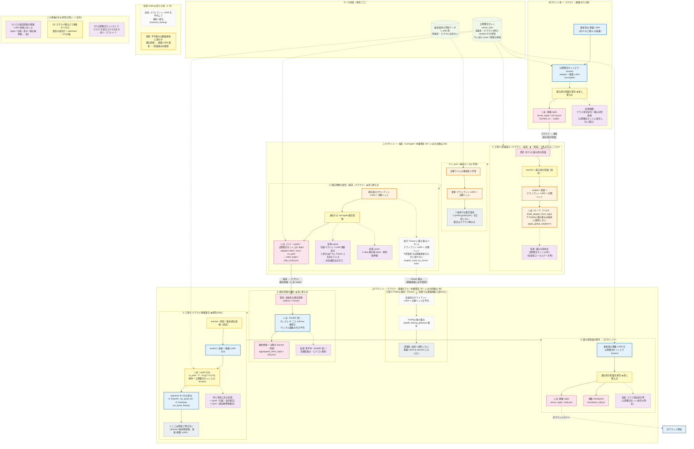

# 提案ループ全体 — 1 ラウンド詳細フロー（全 Stage 共通）

> 用語: `terminology.mdc` / `step07_flow_terminology.mdc`  
> 骨格は全 Stage 共通。[ ] 内・破線ノードだけが Stage / 拡張で差し替わる。  
> いまの実験済み: 比較パターン①（`ac_lpred_df`）／②（`ac_lpred_fedopt`）。差はクラウド側 optimizer のみ。  
> 1 文: **端末で学ぶ → 適応情報でクラウドの基盤 LoRA を整える → 基盤の知識を端末へ還す**

---

## 完全フローチャート（端末 ↔ クラウド）

---

## 工程対応表（入力 → 出力 / 更新）

| 工程 | 場所 | 入力 | 出力 / 更新対象 | いま（①②） | 拡張（同じ枠） | 「蒸留」と呼ぶか |
|------|------|------|-----------------|------------|----------------|------------------|
| 工程⑤ 知識還元 | 端末 | 前 R の**還元用の知識** | **クライアント LoRA + 分類ヘッド** | 基盤 logits の KL 蒸留 | 担体を公開整合セット以外へ | ✅ **ここだけ** |
| L_task | 端末 | 端末固有データ | **クライアント LoRA + 分類ヘッド** | 同左 | 継続学習タスク列（Step 6） | ❌ |
| 適応情報送信 | 端末→sidecar/Flower | 更新後クライアント LoRA | 適応情報 JSON / 差分 | logits（公開整合セット上） | 勾配・LoRA 差分 / 1-step 適応後出力 | ❌ |
| 工程③ FedAvg 集約 | クラウド（Flower） | 各端末のクライアント LoRA + 分類ヘッド | FedAvg 後の重み（提案では基盤更新に不使用） | 計算はするが配布・整合に使わない | — | ❌ |
| 適応情報集約 | クラウド | 各端末の適応情報 | **集約情報**（teacher / 参照） | 重み付き softmax 平均（FedDF 型） | 等平均・信頼度重み等 | ❌ |
| 工程④ 基盤整合 | クラウド | 集約情報 + 担体 | **基盤 LoRA** | Lpred × AdamW / FedAdam | +Lgrad / +Lpost | ❌（整合） |
| 還元用知識の保存 | クラウド | 更新後基盤 LoRA | 次 R 用の還元知識 | 公開整合セット上の基盤 logits | クラス単位統計等 | ❌ |

---

## 場所の対応

| | 役割 | 本番想定 | いまの実験 |
|--|------|----------|------------|
| **端末** | surrogate モデル + **クライアント LoRA + 分類ヘッド** | 3B | 3B |
| **クラウド** | 基盤モデル + **基盤 LoRA** | 7B | 3B（同型で手順検証） |

---

## 従来 FedAvg 型との差（1 行）

- 従来（`baseline_fedavg`）: **FedAvg 後の重み**を端末へ配布して終わり
- 提案: 平均重みは基盤更新に使わず、**適応情報 → 基盤 LoRA 更新 → 知識還元**の循環

---

## 図の読み方（差し替え点）

黄色ノードが **全 Stage 共通の骨格上の差し替え点**:

1. **還元用の知識** … いまは基盤 logits。拡張で公開整合セット非依存の表現へ
2. **surrogate 適応情報** … いまは logits（Lpred）。同じ送信スロットに勾配差分（Lgrad）・適応後挙動（Lpost）
3. **集約方式** … いまは FedDF 型重み付き平均。拡張で等平均・ロバスト集約
4. **整合損失** … いまは Lpred のみ。同じクラウド更新場所に +Lgrad / +Lpost
5. **optimizer** … ① AdamW / ② FedAdam（実験済みの軸）

破線・紫 = 未実験の拡張。灰色 = Flower 上は流れるが提案の基盤更新には使わない経路。
