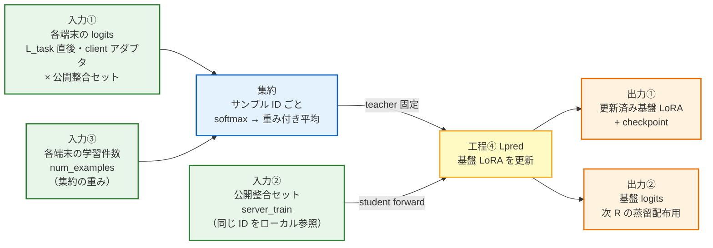
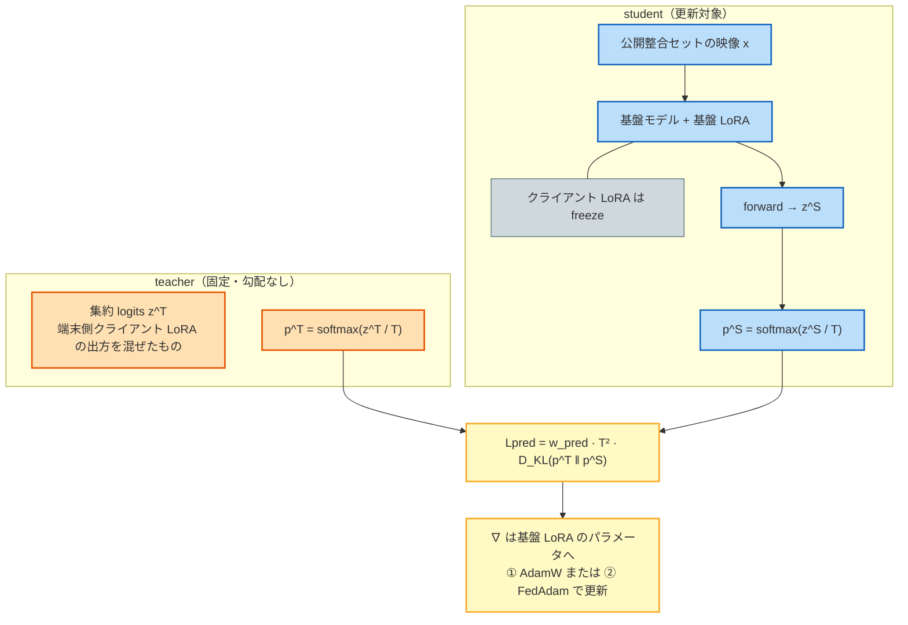

# クラウド側・基盤 LoRA 更新 — 詳細フロー（Lpred）

> 用語: `terminology.mdc` / `step07_flow_terminology.mdc`  
> 実装: `src/fl_step07/server_phase.py` → `_run_proposed` / `_collect_client_logits` / `train_server_consistency_transmitted`  
> 比較: ① `ac_lpred_df`（AdamW）vs ② `ac_lpred_fedopt`（FedAdam）。送る情報・損失は同じ。  
> **ここは蒸留ではない。** 蒸留は次ラウンドの工程⑤（クラウド→端末）のみ。

---

## 全体ズーム（入出力の骨格）

---

## 詳細フローチャート（受信 → 集約 → Lpred → 還元準備）

```mermaid
flowchart TB
  classDef cloud fill:#e3f2fd,stroke:#1565c0,stroke-width:2px
  classDef data fill:#f1f8e9,stroke:#558b2f,stroke-width:1px,stroke-dasharray:4 3
  classDef file fill:#fce4ec,stroke:#c2185b,stroke-width:1px
  classDef key fill:#fff9c4,stroke:#f9a825,stroke-width:2px
  classDef note fill:#eceff1,stroke:#607d8b,stroke-width:1px
  classDef opt1 fill:#c8e6c9,stroke:#2e7d32,stroke-width:2px
  classDef opt2 fill:#bbdefb,stroke:#1565c0,stroke-width:2px

  %% ========== 0. 前提 ==========
  START(["Flower aggregate_fit<br/>ラウンド N 開始"]):::cloud

  subgraph S0["0. 前提・並行して起きるが基盤更新には使わない"]
    FAVG["工程③ FedAvg 集約<br/>クライアント LoRA + 分類ヘッドの平均<br/>→ FedAvg 後の重み"]:::note
    FAVGn["提案系: この重みを<br/>基盤 LoRA に載せない<br/>基盤更新の teacher にもしない"]:::note
    FAVG --> FAVGn
  end

  START --> S0
  START --> S1

  %% ========== 1. 受信 ==========
  subgraph S1["1. 端末 logits の受信（何が来るか）"]
    direction TB
    R1["sidecar 読込<br/>client_logits/r{N}_c*.json<br/>端末数ぶん揃うまで待つ"]:::file
    R2["各ファイルの中身"]:::cloud
    R2a["・round<br/>・sample_ids<br/>・logits: 各クラスへのスコア"]:::cloud
    R3["出所の確認（教授 4 点の 1）"]:::data
    R3a["モデル: 端末 surrogate<br/>＋ クライアント LoRA + 分類ヘッド<br/>※基盤 LoRA の出力ではない"]:::data
    R3b["データ: 公開整合セット server_train<br/>※端末の L_task 用データではない"]:::data
    R3c["タイミング: そのラウンドの<br/>L_task 直後・eval・no_grad"]:::data
    R1 --> R2 --> R2a
    R1 --> R3
    R3 --> R3a & R3b & R3c
  end

  %% ========== 2. 集約 ==========
  subgraph S2["2. 複数端末 logits の集約（教授 4 点の 2）"]
    direction TB
    A0{"端末数 == 1?"}:::cloud
    A1["そのまま teacher 候補"]:::cloud
    A2["サンプル ID ごとに処理"]:::cloud
    A3["各端末の logits → softmax<br/>→ クラス確率 p_c"]:::cloud
    A4["重み w_c = その端末の<br/>L_task 学習件数 num_examples<br/>※公開整合セット件数ではない"]:::cloud
    A5["p̄ = Σ (w_c · p_c) / Σ w_c<br/>FedDF 型・サンプル数重み付き平均"]:::key
    A6["集約 logits を sidecar 保存<br/>aggregated_client_logits/r{N}.json"]:::file
    A7["※比較パターン①②ではこの方式で共通<br/>等平均（FedMD 型）は当面の主比較外"]:::note

    A0 -->|Yes| A1
    A0 -->|No| A2
    A2 --> A3 --> A4 --> A5
    A1 --> A6
    A5 --> A6
    A6 --> A7
  end

  S1 --> S2

  %% ========== 3. Lpred 更新 ==========
  subgraph S3["3. 工程④ クラウド基盤整合 Lpred（教授 4 点の 3）★中心"]
    direction TB
    L0["準備"]:::cloud
    L0a["基盤モデル上で<br/>基盤 LoRA（コード: surrogate アダプタ）を trainable<br/>クライアント LoRA 側は freeze"]:::cloud
    L0b["teacher = 集約 logits を固定<br/>（このステップでは再計算しない）"]:::cloud
    L0c["optimizer を組み立て<br/>build_server_optimizer"]:::cloud

    L0 --> L0a --> L0b --> L0c

    L0c --> OPT{"比較パターン"}:::cloud
    OPT -->|"① ac_lpred_df"| O1["AdamW<br/>lr = train.lr"]:::opt1
    OPT -->|"② ac_lpred_fedopt"| O2["FedAdam 型<br/>β1=0.9, β2=0.99, τ=1e-3<br/>同じ Lpred 勾配を別 optimizer で適用"]:::opt2

    O1 --> LOOP
    O2 --> LOOP

    subgraph LOOP["公開整合セットを 1 サンプルずつ回す"]
      direction TB
      B1["サンプル x ∈ server_train を読込"]:::data
      B2["基盤 LoRA を有効にして forward<br/>→ student logits z^S"]:::cloud
      B3["同じ sample_id の teacher logits z^T<br/>を集約マップから取得"]:::cloud
      B4["温度 T=2.0 でソフト化<br/>p^T = softmax(z^T / T)<br/>p^S = softmax(z^S / T)"]:::cloud
      B5["Lpred = w_pred · T² · KL(p^T ‖ p^S)<br/>w_pred=0.5, T=2.0<br/>実装: lpred_from_teacher_logits"]:::key
      B6["※ L_task（正解ラベル CE）は入れない<br/>consistency.w_task = 0.0"]:::note
      B7["backward → optimizer.step<br/>更新されるのは基盤 LoRA のみ"]:::key

      B1 --> B2 --> B3 --> B4 --> B5 --> B6 --> B7
      B7 -->|"次サンプル / max_server_steps まで"| B1
    end

    LOOP --> LDONE["サーバ整合ステップ完了<br/>loss_pred 等を記録"]:::cloud
  end

  S2 --> S3

  %% ========== 4. 評価・還元準備 ==========
  subgraph S4["4. 更新後の評価と還元準備（教授 4 点の 4）"]
    direction TB
    E1["任意: server_eval で<br/>基盤 LoRA の精度を計測"]:::cloud
    E2["更新済み基盤 LoRA を<br/>server_train 上で forward"]:::cloud
    E3["基盤 logits を sidecar 保存<br/>server_logits/r{N}.json"]:::file
    E4["基盤 checkpoint 保存<br/>foundation_r{N}.pt<br/>classifier + backbone_peft"]:::file
    E5["次ラウンド・端末の工程⑤<br/>teacher = この基盤 logits<br/>student = クライアント LoRA + 分類ヘッド<br/>← ここだけを『蒸留』と呼ぶ"]:::key

    E1 --> E2 --> E3 --> E4 --> E5
  end

  S3 --> S4
  S4 --> END(["ラウンド N のクラウド処理終了<br/>次ラウンドで端末が蒸留配布から開始"]):::cloud
```

---

## Lpred 1 ステップの中身（さらに拡大）

---

## 入出力一覧（報告・スライド用）

| 段階 | 入力 | 出力 | 更新対象 | 参考研究 | 差分・注意 |
|------|------|------|----------|----------|-----------|
| 受信 | 端末ごとの logits sidecar | （保持） | — | FedMD / FedDF | 生データは送らない |
| 集約 | 複数 logits + num_examples | **集約 logits** | — | FedDF [3] | 重みは L_task 件数 |
| 工程④ Lpred | 集約 logits + server_train | 更新済み**基盤 LoRA** | **基盤 LoRA** | FedDF + サーバ最適化 | FedAvg を最終更新にしない。L_task なし |
| 還元準備 | 更新済み基盤 LoRA × server_train | **基盤 logits** | — | FedMD Digest 形式 | teacher=基盤、student=端末 |
| 次 R 工程⑤ | 基盤 logits | — | **クライアント LoRA + 分類ヘッド** | FedMD Digest / FedDF | **ここだけ蒸留** |

---

## ① vs ② で変わるところ / 変わらないところ

| | ① `ac_lpred_df` | ② `ac_lpred_fedopt` |
|--|-----------------|---------------------|
| 端末が送るもの | 同じ（公開整合セット上のクライアント LoRA logits） | 同左 |
| 集約 | 同じ（サンプル数重み付き softmax 平均） | 同左 |
| 損失 Lpred | 同じ（KL×T²、T=2.0、w_pred=0.5） | 同左 |
| **クラウド側 optimizer** | **AdamW** | **FedAdam**（β1=0.9, β2=0.99, τ=1e-3） |
| 配布 | 同じ（基盤 logits による蒸留配布） | 同左 |

---

## 禁止表現チェック（この図で使わない言い方）

| ❌ 使わない | ✅ 代わり |
|------------|----------|
| 基盤 logits へ蒸留 | 集約 logits を teacher に、基盤 LoRA を Lpred で整合更新 |
| サーバ蒸留で基盤を更新 | 工程④ クラウド基盤整合（Lpred） |
| teacher の更新対象が基盤 LoRA | teacher=集約 logits（固定）、更新=基盤 LoRA（student） |
| ③ 単独 | 工程③ FedAvg 集約 / 比較パターン③（FedMD 型・当面外） |
