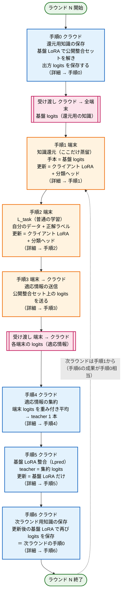
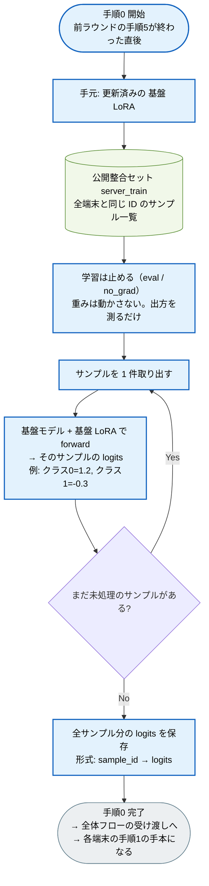
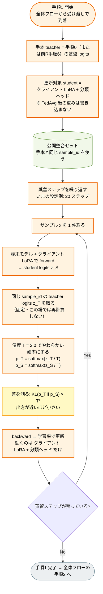
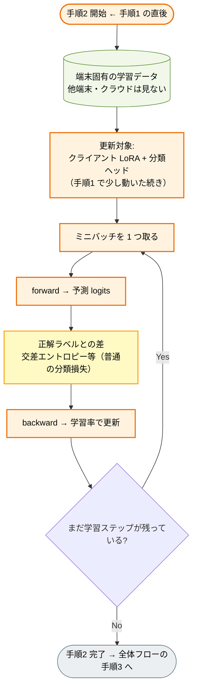
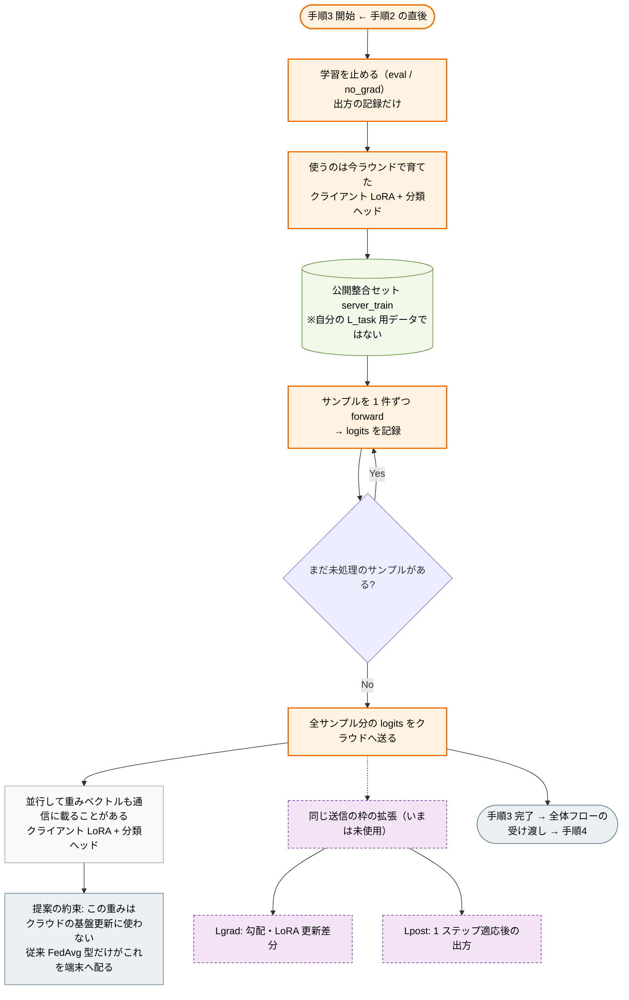
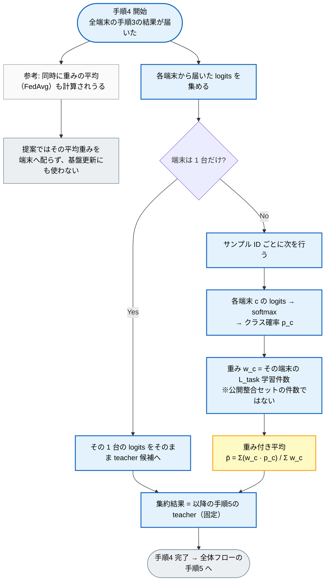
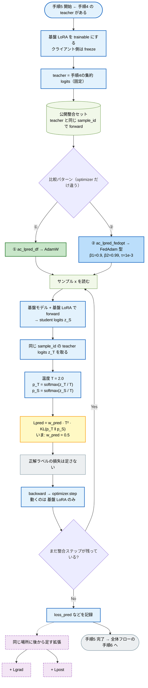
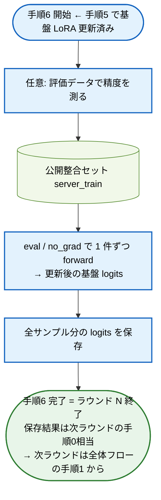

# 提案ループ全体 — 1 ラウンド詳細フローチャート

> **何をしているか（1 文）**  
> 各端末で学ぶ → その「学びの痕跡」でクラウドの大きい AI の追加重み（基盤 LoRA）を整える → 整えた知識を再び端末へ還す。これを毎ラウンド繰り返す。
>
> **いまの実験** … 比較パターン①②（送る情報は logits ＝ Lpred）。①と②の差はクラウド側の更新アルゴリズム（AdamW / FedAdam）だけ。

---

## この文書の読み方

1. 下の **対応表** で「全体の箱」＝「詳細の見出し」を確認する  
2. **全体フロー** を上から一度読む  
3. 知りたい箱だけ、同じ番号の **手順0〜6** を開く  

**番号は全体フローと詳細で同じです。**（§2・§3 のような別番号は使いません）

| 全体フローの箱 | 詳細の見出し | 場所 |
|----------------|--------------|------|
| **手順0** | [手順0 — 還元用知識の保存](#手順0--還元用知識の保存前ラウンド末クラウド) | クラウド |
| **手順1** | [手順1 — 知識還元（蒸留）](#手順1--知識還元蒸留端末) | 端末 |
| **手順2** | [手順2 — L_task](#手順2--ltask端末) | 端末 |
| **手順3** | [手順3 — 適応情報の送信](#手順3--適応情報の送信端末クラウド) | 端末→クラウド |
| **手順4** | [手順4 — 適応情報の集約](#手順4--適応情報の集約クラウド) | クラウド |
| **手順5** | [手順5 — 基盤 LoRA 整合（Lpred）](#手順5--基盤-lora-整合lpredクラウド) | クラウド |
| **手順6** | [手順6 — 次ラウンド用知識の保存](#手順6--次ラウンド用知識の保存クラウド) | クラウド |

※ **手順0 と手順6は同じ操作**（基盤 LoRA の出方を保存する）。手順6の結果が、次ラウンドの手順0／手順1の入力になる。

設計書の「工程⑤／工程④」との対応（紛らわしいので図では使わない）:

| この文書 | 設計書の呼び方 |
|----------|----------------|
| 手順1 | 工程⑤ 蒸留配布 |
| 手順5 | 工程④ クラウド基盤整合（Lpred） |

---

## 0. 登場人物（先にこれだけ覚える）

| 名前 | かみ砕き | 本番想定 | いまの実験 |
|------|----------|----------|------------|
| **端末**（surrogate） | 手元の小さい AI。各クライアントが 1 台ずつ持つ | 3B | 3B |
| **クライアント LoRA + 分類ヘッド** | 端末側の「自分用の小さな追加重み」。端末で学習し、更新する主対象 | — | — |
| **クラウド**（基盤モデル） | みんなで共有する大きい AI | 7B | 3B（手順検証用に同型） |
| **基盤 LoRA** | クラウド側の「共有用の小さな追加重み」。クラウドでだけ更新する | — | — |
| **公開整合セット**（`server_train`） | 全端末とクラウドが **同じサンプル ID** で見られる公開データ。出方合わせの共通の「問題用紙」 | — | — |
| **logits** | モデルが各クラスに付けたスコア（確率の元）。画像そのものは送らない | — | — |

**従来（FedAvg 型）との違い（1 行）**  
従来は「端末の追加重みを平均して、そのまま端末へ配る」。提案は「平均重みは基盤の更新に使わず、端末の出方（適応情報）で **基盤 LoRA** を直し、その知識を端末へ還す」。

**「蒸留」という言葉** … **手順1（クラウド → 端末）だけ**に使う。手順5（クラウドで基盤 LoRA を直す）は「整合」であり蒸留ではない。

---

## 1. 全体フロー（1 ラウンド）

オレンジ = 端末、青 = クラウド、ピンク = 受け渡し。  
各箱の番号は、この下の **手順0〜6** の見出しと 1 対 1。

---

## 手順0 — 還元用知識の保存（前ラウンド末・クラウド）

← 全体フローの **手順0** の拡大。手順6 と同じ操作。

**目的:** 次の手順1で端末が真似できる「クラウドの答えの出し方」を残す。

**かみ砕き:** クラウドの大きい AI に公開の問題用紙を全部解かせ、「各問題への点数の付け方」を残す。次に端末がそのノートを見る。

---

## 手順1 — 知識還元（蒸留・端末）

← 全体フローの **手順1** の拡大。**ここだけを「蒸留」と呼ぶ。**

**目的:** クラウドの出方に、端末のクライアント LoRA を近づける。基盤 LoRA は触らない。

**かみ砕き:** クラウドの解答ノートを見て、「自分の点数の付け方」を似せる。正解ラベルは使わず、出方の形だけ合わせる。

---

## 手順2 — L_task（端末）

← 全体フローの **手順2** の拡大。

**目的:** 端末固有データで、分類の正解に合わせる。端末では整合損失を混ぜない。

**かみ砕き:** 自分の写真と正解ラベルで、普通に「当てる」練習をする。

---

## 手順3 — 適応情報の送信（端末→クラウド）

← 全体フローの **手順3** の拡大。

**目的:** 学習後の端末が、公開の問題用紙にどう答えるかをクラウドへ渡す。送るのはスコア表（logits）。画像そのものは送らない。

**かみ砕き:** 「公開の問題用紙」への自分の採点表をクラウドに提出する。

---

## 手順4 — 適応情報の集約（クラウド）

← 全体フローの **手順4** の拡大。

**目的:** 端末ごとの採点表を、1 つの「みんなの平均的な出方」（teacher）にする。  
いまの方式 = 確率にしてから、学習件数で重み付き平均（FedDF 型）。

**かみ砕き:** クラスの答案を集めて、「データ量が多い端末の意見を少し厚くした平均答案」を作る。

---

## 手順5 — 基盤 LoRA 整合（Lpred・クラウド）

← 全体フローの **手順5** の拡大。**ここは蒸留ではない。**

**目的:** 集約した端末の出方に、クラウドの基盤 LoRA の出方を近づける。更新は基盤 LoRA だけ。

**かみ砕き:** 「みんなの平均答案」を手本に、クラウド本体の追加重みだけを直す。①と②は直し方の道具（optimizer）が違うだけ。

---

## 手順6 — 次ラウンド用知識の保存（クラウド）

← 全体フローの **手順6** の拡大。**中身は手順0と同じ。** 更新後の基盤 LoRA でやり直す。

**目的:** 新しい出方を残し、次ラウンドの手順1の手本にする。

---

## 付録A — 何が更新され、何が送られるか

| 手順 | 場所 | 入力 | 更新 / 出力 | 蒸留？ |
|------|------|------|-------------|--------|
| 0 | クラウド | 基盤 LoRA × 公開整合セット | 基盤 logits（還元用知識） | ❌ |
| 1 | 端末 | 前Rの基盤 logits | **クライアント LoRA + 分類ヘッド** | ✅ |
| 2 | 端末 | 端末固有データ + 正解 | **クライアント LoRA + 分類ヘッド** | ❌ |
| 3 | 端末→クラウド | 更新後クライアント LoRA × 公開整合セット | 端末 logits（適応情報） | ❌ |
| 4 | クラウド | 各端末 logits | 集約 logits（teacher） | ❌ |
| 5 | クラウド | 集約 logits × 公開整合セット | **基盤 LoRA** | ❌（整合） |
| 6 | クラウド | 更新後基盤 LoRA × 公開整合セット | 次R用の基盤 logits | ❌ |

---

## 付録B — この骨格から出る研究の問い

| 問い | 中身 | 対応 |
|------|------|------|
| **Q1** | どの適応情報が基盤 LoRA 更新に効くか（logits / 勾配・差分 / 適応後挙動） | 柱2・手順3〜5の差し替え |
| **Q2** | クラウド側はどう更新すべきか（損失の組合せ × optimizer） | いまの①②＝手順5の分岐 |
| **Q3** | 公開整合セットなしで手順3〜6を成立させられるか | 柱3 |
