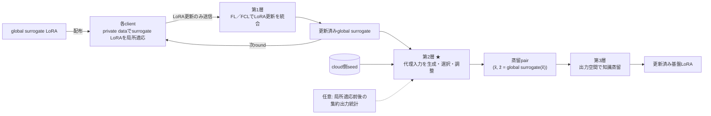

# Adaptation Consistency — 全体処理フロー

> private データで局所適応した surrogate の出力挙動を、共有整合データを使わずに統合し、代理データと logits のペアを介して異種の基盤モデルへ移す。

| 層 | 役割 | 出力 |
|---|---|---|
| **第1層** | 同一構造の surrogate 間で更新方向のずれと忘却を扱う | global surrogate LoRA |
| **第2層** | global surrogate の挙動を引き出す代理入力を決め、同じ入力への logits を付ける | `(代理データ, logits)` |
| **第3層** | 共通出力空間を介して異種の大型基盤モデルへ移す | 基盤 LoRA |

## 確認が必要な点

1. 局所学習前後の logits は、private 入力と対応しない**集約統計**として第2層を補助する理解でよいか。
2. surrogate と基盤モデルが共有する出力空間は、現状の分類クラス logits でよいか。
3. 基盤モデルからclientへの知識還元は今回の定義に含めるか、別経路とするか。
