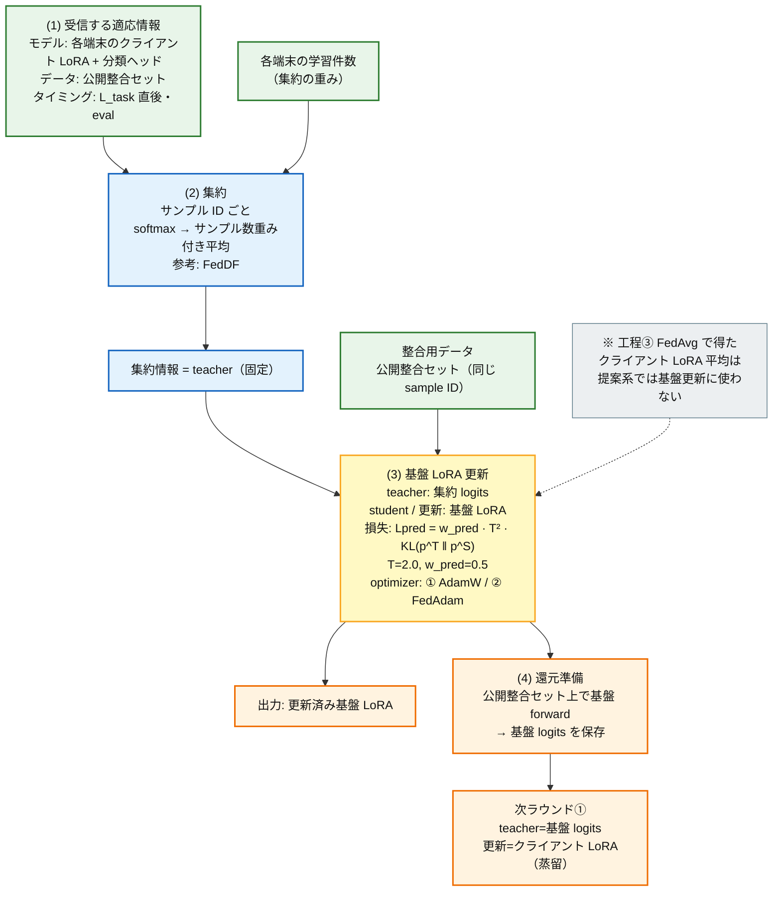
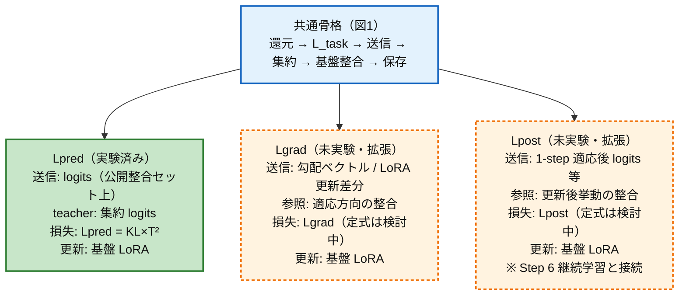

# 研究会たたき台 — 処理フロー（2026-07-23）

> **目的:** 先生指示どおり、詳細を確定せずに **提案ループの骨格** と **クラウド側基盤 LoRA 更新** を可視化する。  
> **粒度:** PDF「研究の新規性と課題」§2 基本処理フロー相当。実装細部・ハイパラは書かない。  
> **用語:** `terminology.mdc` / `step07_flow_terminology.mdc`。  
> **詳細図:** [`a.md`](a.md)（全体）/ [`b.md`](b.md)（クラウド拡大）/ [`c.md`](c.md)（手順0〜6）。  
> **PPT 転記用:** 本ファイルの図1→図2→図3 をそのままスライド化。

**発表順:** 図1（共通骨格）→ 図2（クラウド基盤更新）→ 図3（Lpred/Lgrad/Lpost 分岐）→ 整合用データの位置づけ（口頭）

---

## 図1 — 提案ループ全体（Lpred / Lgrad / Lpost 共通骨格）

**1 文:** 端末で学ぶ → 適応情報でクラウドの **基盤 LoRA** を整える → 基盤の知識を端末へ還す。

角括弧 `[ ]` は Stage で差し替わるスロット。骨格の箱と矢印の順序は全 Stage 共通。

```mermaid
flowchart TB
  classDef edge fill:#fff3e0,stroke:#ef6c00,stroke-width:2px,color:#111
  classDef cloud fill:#e3f2fd,stroke:#1565c0,stroke-width:2px,color:#111
  classDef msg fill:#fce4ec,stroke:#c2185b,stroke-width:2px,color:#111
  classDef data fill:#f1f8e9,stroke:#558b2f,stroke-width:1px,color:#111
  classDef slot fill:#fffde7,stroke:#f9a825,stroke-width:2px,color:#111
  classDef undecided fill:#fafafa,stroke:#9e9e9e,stroke-width:1px,stroke-dasharray:4 3,color:#111

  PUB[("整合用データの担体<br/>いま: 公開整合セット server_train<br/>※差し替えは未確定")]:::data
  PUB -.->|"未確定候補<br/>（後で比較）"| ALT["クラス統計 / 生成入力 / 非共有サンプリング 等"]:::undecided

  PRE["前ラウンド末・クラウド<br/>入力: 更新済み基盤 LoRA<br/>処理: 整合用データ上で forward<br/>出力: 還元用の知識"]:::cloud
  PUB -.-> PRE
  PRE --> KNOW["還元用の知識を保存<br/>いま: 基盤 logits"]:::slot

  KNOW -->|"クラウド→端末<br/>還元用の知識"| R1

  subgraph EDGE["各端末"]
    direction TB
    R1["① 知識還元<br/>入力: 還元用の知識（teacher）<br/>損失: いま KL×T²（蒸留）<br/>更新: クライアント LoRA + 分類ヘッド<br/>※「蒸留」と呼ぶのはここだけ"]:::edge
    R2["② L_task<br/>入力: 端末固有の学習データ<br/>損失: 教師あり分類<br/>更新: クライアント LoRA + 分類ヘッド"]:::edge
    R3["③ 適応情報の送信<br/>入力: 適応後のクライアント LoRA<br/>データ: いまは公開整合セット<br/>出力: [適応情報]"]:::slot
    R1 --> R2 --> R3
  end

  R3 -->|"端末→クラウド<br/>[適応情報]"]:::msg AGG

  subgraph CLOUD["クラウド"]
    direction TB
    AGG["④ 適応情報の集約<br/>入力: 各端末の適応情報<br/>出力: 集約情報（teacher / 参照）"]:::cloud
    UPD["⑤ 基盤 LoRA 整合更新<br/>入力: 集約情報 + 整合用データ<br/>損失: [整合損失]<br/>更新: 基盤 LoRA のみ"]:::slot
    SAVE["⑥ 還元用知識の保存<br/>入力: 更新後基盤 LoRA<br/>出力: 次ラウンド用の還元用知識"]:::cloud
    AGG --> UPD --> SAVE
  end

  PUB -.-> R3
  PUB -.-> UPD
  PUB -.-> SAVE
  SAVE -.->|"次ラウンドの①へ"| R1
```

### 図1 — 工程表（入力 / 出力 / 更新）

| 手順 | 場所 | 入力 | 出力 / 更新対象 | いま（実験済み Lpred） | 差し替えスロット |
|------|------|------|-----------------|------------------------|------------------|
| ① 知識還元 | 端末 | 還元用の知識 | **クライアント LoRA + 分類ヘッド** | 基盤 logits の KL 蒸留 | 還元の担体 |
| ② L_task | 端末 | 端末固有データ | **クライアント LoRA + 分類ヘッド** | 同左 | （共通） |
| ③ 送信 | 端末→クラウド | 適応後クライアント LoRA | **適応情報** | 公開整合セット上の logits | 送信内容（→図3） |
| ④ 集約 | クラウド | 各端末の適応情報 | **集約情報** | 重み付き softmax 平均 | 集約方式 |
| ⑤ 基盤整合 | クラウド | 集約情報 + 整合用データ | **基盤 LoRA** | Lpred（KL×T²） | 損失・optimizer（→図2・図3） |
| ⑥ 保存 | クラウド | 更新後基盤 LoRA | 還元用の知識 | 公開整合セット上の基盤 logits | 還元の担体 |

**従来 FedAvg 型との差（1 行）:** 従来は **FedAvg 後の重み**を端末へ配布して終わり。提案は平均重みを基盤更新に使わず、**適応情報 → 基盤 LoRA 更新 → 知識還元**の循環。

**整合用データの位置づけ（口頭用・妥当性は未判断）:**  
図中の緑ノードが「いまの担体」。点線の候補（統計・生成・非共有サンプリング等）は **スロットの埋め方の候補**であり、有効性・代表性・性能・プライバシーの比較は骨格共有後に行う。

---

## 図2 — クラウド側・基盤 LoRA 更新（拡大）

教授から明確化を求められた 4 点に対応。実験済み経路 = Lpred（比較パターン① AdamW / ② FedAdam）。**ここは蒸留ではない**（蒸留は図1の①のみ）。



### 図2 — 段階表（入力 / 出力 / 更新 / 参考 / 差分）

| 段階 | 入力 | 出力 | 更新対象 | 参考研究 | 既存との差分・本研究の検討点 |
|------|------|------|----------|----------|------------------------------|
| (1) 受信 | 端末ごとの logits | （保持） | — | FedMD / FedDF | 出所を明示: **端末のクライアント LoRA** × **公開整合セット**（端末学習データではない） |
| (2) 集約 | 複数 logits + 学習件数 | 集約 logits | — | FedDF [3] | 集約方式の本格比較は補助。主眼は基盤更新 |
| (3) Lpred | 集約 logits + 公開整合セット | 更新済み基盤 LoRA | **基盤 LoRA** | FedDF + サーバ最適化 | FedAvg を最終更新にしない。更新対象が **基盤 LoRA**（FedMD は端末側） |
| (4) 還元準備 | 更新済み基盤 LoRA | 基盤 logits | — | FedMD Digest 形式 | teacher=基盤、student=端末 |
| 次 R 蒸留 | 基盤 logits | — | **クライアント LoRA** | FedMD Digest / FedDF | 「蒸留」はクラウド→端末のみ |

### 図2 — 教授 4 点への一文回答

1. **どのモデルが、どのデータに対する logits か** … 各端末の **クライアント LoRA + 分類ヘッド** 付き surrogate が、**公開整合セット**上で L_task 直後に出力したもの。
2. **どう集約するか** … サンプル ID ごとに softmax 確率を **サンプル数重み付き平均**（FedDF 型）。
3. **どの損失で何を更新するか** … 集約 logits を teacher に固定し、**基盤 LoRA** を **Lpred（KL×T²）** で更新。optimizer は ① AdamW / ② FedAdam。
4. **次ラウンドのクライアント LoRA をどう蒸留するか** … 更新後基盤の logits を teacher に、端末の **クライアント LoRA + 分類ヘッド** を KL 蒸留（図1の①）。

---

## 図3 — Lpred / Lgrad / Lpost の分岐（たたき台）

共通骨格（図1）は同じ。差し替えるのは **送信情報・クラウドでの参照の使い方・損失**。更新の中心対象はいずれも **基盤 LoRA**。

> **注意:** Lgrad / Lpost は未実験。前回資料の「Lgrad 基本処理フロー」を清書コピーせず、現行の送信スロット設計に合わせて再整理したたたき台。詳細定式は未確定。



### 図3 — 差し替え表

| 項目 | Lpred（いま） | Lgrad（拡張） | Lpost（拡張） |
|------|---------------|---------------|---------------|
| **端末→クラウドの送信** | 公開整合セット上の **logits** | **勾配** / **LoRA 更新差分**（差分は Flower 上を既に流れる） | **1-step 適応後 logits**・更新後挙動 |
| **クラウドでの teacher / 参照** | 集約 logits を teacher に固定 | 適応方向（勾配・差分）を参照して整合 | 適応後の出方を参照して整合 |
| **損失** | Lpred（KL×T²） | Lgrad（MSE / 方向類似度等・未確定） | Lpost（適応後 KL 等・未確定） |
| **更新対象** | **基盤 LoRA** | **基盤 LoRA** | **基盤 LoRA** |
| **還元（図1①）** | 基盤 logits → クライアント LoRA（蒸留） | 同枠（担体は別途検討） | 同枠（担体は別途検討） |
| **状態** | ①② で実験済み | 未実験 | 未実験（Step 6 とセット評価） |

**前回「Lgrad 基本処理フロー」からの整理し直し（妥当性確認）**

| 観点 | 前回図で起きやすかった解釈 | たたき台での扱い |
|------|---------------------------|------------------|
| 送信の主役 | ΔW 統合が基盤更新そのものに見える | Lgrad でも送信は **勾配/差分スロット**。提案系では FedAvg 平均重みを基盤更新の teacher にしない |
| 損失の束 | Lpred+Lrepr+Lgrad+Lpost が同時に中心 | まず Lpred で骨格を固定し、同じ場所に Lgrad / Lpost を足す |
| 更新対象 | 「基盤を進化」と曖昧 | 明示: **基盤 LoRA のみ** |
| データ | 公開データの役割が図から読み取りにくい | 図1の緑ノード＝整合用データの担体。差し替えは未確定 |

---

## 口頭用 — 整合用データ（妥当性は求めない）

先生の理解どおり、先に送った「公開整合セット依存の改善案」は、図1の **「どの整合用データに対して適応情報を計算し、基盤を更新するか」** という点の検討である。

明日の研究会では:

1. 図1〜3で **処理の順序・入出力・更新対象** を共有する
2. 整合用データは **フロー上の担体スロット** として位置づける（いま = 公開整合セット）
3. 置き換え候補（prototype・統計・生成・非共有サンプリング等）の **妥当性判断は求めない**
4. 骨格共有後に、有効性・代表性・全体性能・プライバシーのバランスで **複数候補を比較**する

---

## PPT への落とし方（最短）

| スライド | 本ファイルの節 | 載せるもの |
|----------|----------------|------------|
| 1 | 図1 | Mermaid を箱に転記 + 工程表 |
| 2 | 図2 | 4 点フロー + 段階表 |
| 3 | 図3 | 分岐図 + 差し替え表 |
| （任意・30秒） | 口頭用 | 「整合用データはスロット。候補の妥当性は後で」 |
