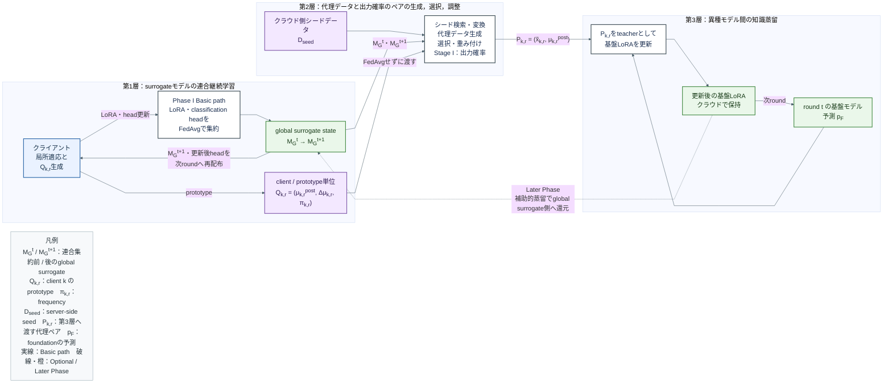
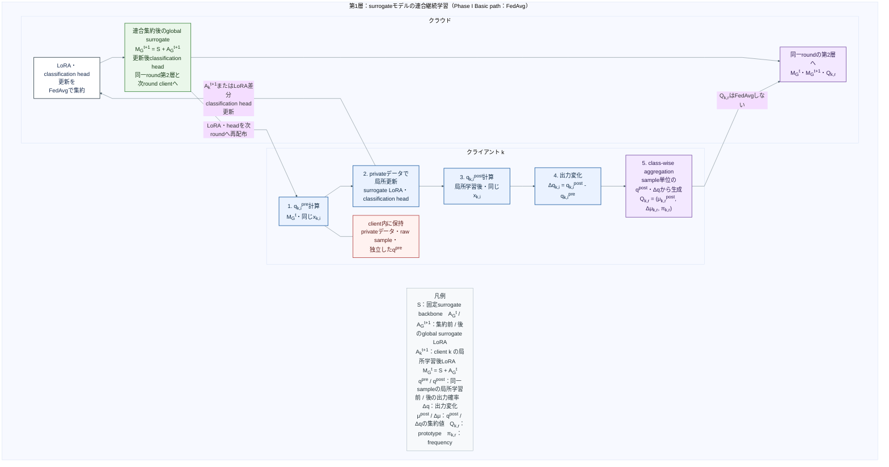
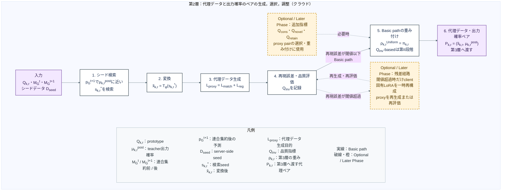
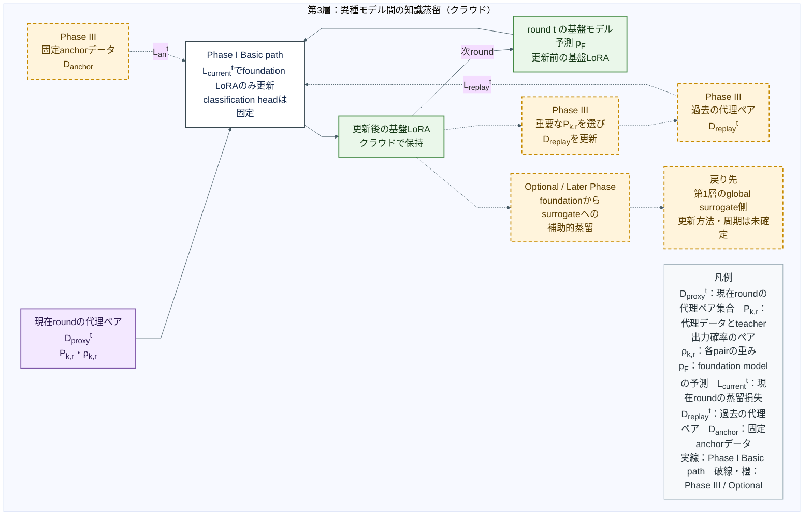

# FedPACT 報告会用フロー図

報告会用の粒度に絞った Mermaid 原稿。各図は PowerPoint 1 枚を想定する。

- 反映基準: 2026年9月16日 09:00 のZettsu教授による処理フロー修正指示
- 現在の実装方針: Phase I Basic path、FedAvg、client側classification headも更新・集約・再配布
- 9月1日PDFの層名は「代理データとlogitsのペア」だが、現行Stage Iでは`q`・`μ`をsoftmax probabilityに固定したため、図中は「出力確率のペア」と表記する
- 最新実装ログの数値結果は動作確認段階であり、手法フローの処理としては追加しない

## 1. FedPACT の全体構造

説明の中心: privateデータを送らず、clientで得た局所適応挙動を三層で基盤モデルへ移す。第1層と第3層の更新状態は、それぞれ次ラウンドへ戻る。

発表時の説明:

- 第1層では、LoRA・classification headの更新と`Q_(k,r)`を別経路で送る。FedAvgするのはLoRA・headであり、`Q_(k,r)`ではない。
- `M_G^t=S+A_G^t`は連合集約前、`M_G^(t+1)=S+A_G^(t+1)`は連合集約後のglobal surrogateである。両方を同じラウンドの第2層で使う。
- `M_G^(t+1)`は次ラウンドのクライアントへ再配布する。更新後の基盤LoRAはクラウドで次ラウンドへ引き継ぐ。
- 更新後foundationからglobal surrogate側への補助的蒸留はLater Phaseであり、更新方法と実行周期は未確定である。

## 2. 第1層：surrogateモデルの連合継続学習

説明の中心: `q^(pre)`から`Δq`までの順序を固定し、LoRA・headの集約経路とprototype経路を分ける。

発表時の説明:

- 順序は`q_(k,i)^pre`計算、局所更新、同じsampleで`q_(k,i)^post`計算、`Δq_(k,i)`計算で固定する。
- Stage Iでは`q^(pre)`と`q^(post)`の実体をsoftmax probability vectorとして扱う。raw logitsとは呼ばない。
- sample単位の`q^(post)`・`Δq`をclient内でclass-wiseに集約し、frequency付き`Q_(k,r)`を作る。`π_(k,r)`はそのprototypeに含まれるsample数であり、FedAvgの重みではない。
- 現在の実装方針ではclassification headも局所更新し、LoRAとともに集約・再配布する。
- clientから送るのはLoRA更新、classification head更新、`Q_(k,r)`と識別情報である。privateデータ、raw frame、client内sample ID、独立した`q^pre`は送らない。

## 3. 第2層：代理データと出力確率のペアの生成，選択，調整

説明の中心: PDFの層名は維持しつつ、Stage Iでペアにする`μ^(post)`は出力確率として示す。残差経路と追加の品質指標は別々のLater Phaseに置く。

発表時の説明:

- `M_G^t`と`M_G^(t+1)`の同じ代理データ上での出力差を使い、`Δμ_(k,r)`の方向を再現する。client固有の`Δμ_(k,r)`とproxy側のglobal round差は別の量である。
- 基本経路は、検索、変換、`L_proxy`による代理データ生成、再現誤差・品質評価、選択、`P_(k,r)`生成の順である。
- Phase I Basic pathの重みは`ρ_(k,r)^Uniform=π_(k,r)`とする。`Q_inv`は記録し、`Q_inv`-basedの重み付け比較は第II段階で行う。
- 再現誤差が閾値を超えた場合だけ残差経路へ分岐する。残差経路の導入条件、閾値、採否は未確定である。
- `Q_cons`・`Q_novel`・`Q_retain`は選択・重み付け用の追加指標であり、残差経路ではない。
- 第3層へ渡すteacher labelは`μ_(k,r)^post`であり、global surrogate自身の出力ではない。

## 4. 第3層：異種モデル間の知識蒸留

説明の中心: Phase Iは現在ラウンドの代理ペアでfoundation LoRAを更新し、その状態を次ラウンドへ戻す。replay・anchor・補助的蒸留は別のLater Phaseとして扱う。

発表時の説明:

- Phase Iでは`D_proxy^t`の`P_(k,r)`を使い、`L_current^t`でfoundation LoRAだけを更新する。現在の実装ではfoundation側classification headは固定する。
- 更新後の基盤LoRAは終了点ではなく、クラウドで保持して次ラウンドの第3層の開始状態へ戻す。
- Phase IIIでは過去の`D_replay^t`と`D_anchor`を追加し、更新後に重要な`P_(k,r)`を選んでreplay memoryを更新する。
- foundationからsurrogateへの補助的蒸留はLater Phaseである。残す場合は、更新後foundationから第1層のglobal surrogate側へ知識を還元する流れとして示す。
- surrogate LoRAとfoundation LoRAは独立しており、LoRA parameterを両model間で直接転送しない。

## PowerPointへ載せる際の制約

- 4図をそれぞれ別スライドに配置する。
- スライドタイトルは図の見出しをそのまま使用する。
- Mermaid画像はスライド横幅の80から90パーセントを使用する。
- 本文相当の文字は17pt未満にしない。
- 各スライドに図中の凡例を残す。
- 数式の詳細、候補ごとのaccept / reject、最新runの診断値は口頭説明か補足スライドへ移す。
- 青はclient側、紫は層間で渡すデータ、緑はモデル状態、赤はclient内保持、白は基本処理、橙の破線はOptional / Later Phaseとして統一する。
